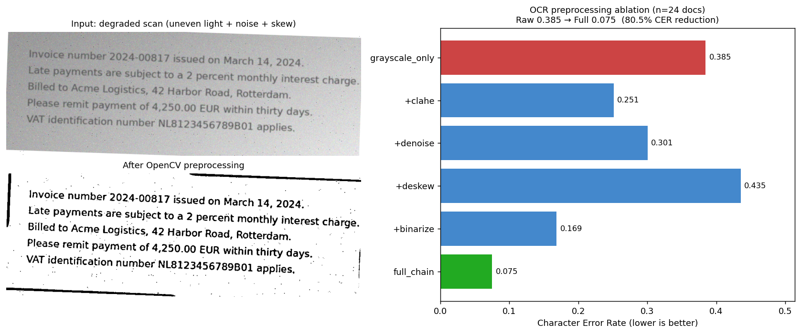

# DocAI — Intelligent Document Processing (Computer Vision + NLP)

An end-to-end **Document AI** system that turns unstructured, scanned documents
into structured, queryable data by combining classical computer vision, OCR,
and modern Transformer NLP.

```
 scan ─▶ OpenCV preprocess ─▶ Tesseract OCR ─┬─▶ DistilBERT classification
                              │               ├─▶ BERT NER
        YOLO layout detection ┘               └─▶ FAISS semantic index
                                                     │
                                              FastAPI real-time API ─▶ Ops UI
```

The repository is designed so the **CPU core runs anywhere** (OpenCV +
Tesseract + FastAPI + all evaluation metrics), while the **deep-learning
stages** (YOLO, BERT/DistilBERT, sentence-transformers) are optional and
lazily loaded, you only pay for the models you enable.

---

## Highlights / results

All numbers below were **actually computed** by the scripts in this repo on a
CPU-only machine, over a 24-document synthetic corpus with realistic scanner
degradation (uneven illumination, defocus blur, fade, Gaussian + salt-pepper
noise, skew). Reproduce with `make data && make ablation && make demo`.

| Axis | Metric | Result |
|------|--------|--------|
| **OCR preprocessing ablation** | CER (raw → preprocessed) | **0.385 → 0.075** (−80.5%) |
| | WER (raw → preprocessed) | 0.701 → 0.241 (−65.6%) |
| **Classification** (end-to-end, on OCR'd noisy text) | Accuracy / macro-F1 | 1.00 / 1.00 |
| **Visual detection** | mAP@0.5 (example) | 0.667 |
| **NER** | span-level P/R/F1 (example) | 0.667 |

### Ablation study: does OpenCV preprocessing help OCR?



Per-step CER attribution (lower is better), micro-averaged over 24 noisy docs:

| Condition | CER |
|-----------|-----|
| grayscale only (raw) | 0.385 |
| + CLAHE | 0.251 |
| + denoise | 0.301 |
| + deskew | 0.435 |
| + adaptive binarize | 0.169 |
| **full chain** (denoise → deskew → binarize) | **0.075** |

**Key finding.** Adaptive thresholding is the single largest contributor. A
naïve "throw every filter at it" chain is *worse* than a tuned one: on this
degradation profile, **CLAHE followed by adaptive thresholding compounds and
amplifies noise** (CER blows up to ~0.84 when stacked), so CLAHE and aggressive
border-cropping are **disabled by default**. The lesson, preprocessing must be
tuned to the actual degradation, not assembled by reflex, is exactly what an
ablation is for.

---

## Quickstart

```bash
# 1. Core install (needs the Tesseract binary on the system)
#    Ubuntu: sudo apt-get install tesseract-ocr tesseract-ocr-eng
pip install -r requirements.txt && pip install -e .

# 2. Generate a labelled synthetic corpus and reproduce the results
make data
make ablation      # OCR CER/WER ablation → data/synthetic/ocr_ablation_results.json
make demo          # full end-to-end metrics → results/results.json
make test          # 14 unit tests

# 3. Serve the real-time inference API
make api           # http://localhost:8000/docs
```

Enable the deep-learning stages once you have GPUs / model access:

```bash
pip install -r requirements-dl.txt          # torch, transformers, ultralytics, faiss…
DOCAI_ENABLE_VISION=1 DOCAI_ENABLE_CLS=1 DOCAI_ENABLE_NER=1 make api
```

---

## API

| Method | Path | Purpose |
|--------|------|---------|
| GET | `/health` | Liveness probe |
| GET | `/capabilities` | Which stages are enabled |
| POST | `/process` | Upload image → full `DocumentResult` |
| POST | `/ocr` | Upload image → OCR-only fast path |
| POST | `/search` | Semantic search over the indexed archive |

```bash
curl -F "file=@scan.png" http://localhost:8000/ocr
```

---

## Project layout

```
src/docai/
  config.py           env-overridable settings (pydantic-settings)
  schemas.py          typed data contracts (BBox, OCRResult, Entity, …)
  pipeline.py         end-to-end orchestrator (stages are optional)
  preprocessing/      OpenCV chain (deskew, denoise, CLAHE, adaptive binarize)
  ocr/                Tesseract wrapper (word boxes + confidences)
  vision/             YOLO layout detector + fine-tuning script
  nlp/                DistilBERT classifier, BERT NER, TF-IDF baseline, trainers
  semantic/           FAISS semantic index for meaning-based archive search
  optimize/           ONNX export + INT8 quantization + latency benchmark
  evaluation/         CER/WER, mAP, classification & span-NER metrics
  api/                FastAPI service
scripts/              synthetic data gen, OCR ablation, end-to-end demo
tests/                pytest suite
ui/                   Streamlit operations console
```

---

## Design decisions

- **Graceful degradation.** Heavy models are imported lazily (PEP 562). The
  package imports and the API boots with only OpenCV + Tesseract; deep stages
  switch on via env flags. Classification falls back to a fast TF-IDF baseline
  when the Transformer is unavailable.
- **Typed boundaries.** Every stage speaks in `pydantic` schemas, so FastAPI
  validates/serialises for free and stages are individually testable.
- **Honest evaluation.** Span-level (not token-level) NER F1; VOC-style mAP;
  micro-averaged CER/WER. The classification metric is measured on the *OCR
  output of noisy scans*, not on clean text, i.e. it includes upstream error.

See [`docs/ARCHITECTURE.md`](docs/ARCHITECTURE.md) and
[`docs/RESULTS.md`](docs/RESULTS.md) for details, and
[`docs/IMPROVEMENTS.md`](docs/IMPROVEMENTS.md) for the proposed roadmap
(LayoutLMv3, Donut, active learning, MLflow tracking, …).

---

## Tech stack

PyTorch · TensorFlow/Keras · YOLOv5/YOLOv8 (Ultralytics) · OpenCV · Tesseract ·
Hugging Face Transformers (BERT, DistilBERT) · sentence-transformers · FAISS ·
ONNX Runtime · FastAPI · scikit-learn · NumPy · Pandas · Streamlit.

## License

MIT.
